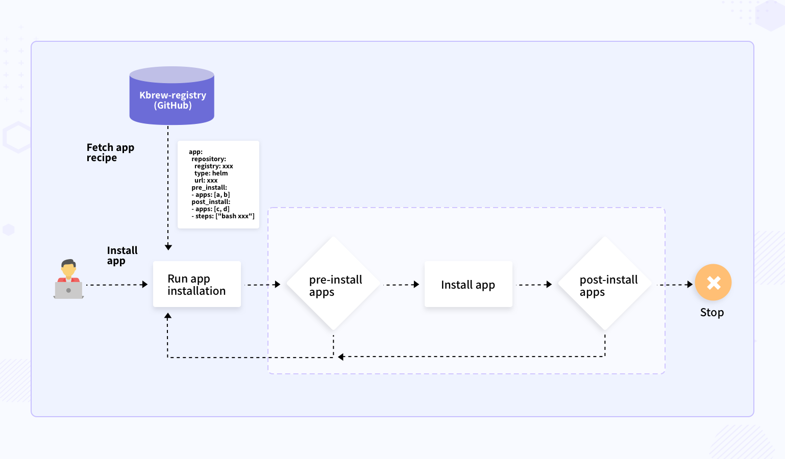

# kbrew

kbrew is to Kubernetes what Homebrew is to MacOS - a simple and easy-to-use package manager which hides the underlying complexity.

Let's talk in the context of an example of installing Kafka on a Kubernetes cluster
 - You need cert-manager & Zookeeper & kube-prometheus-stack for monitoring installed
 - Zookeeper is an operator so you need to create a CR of Zookeeper cluster after installation of the operator.
 - Then install Kafka operator
 - Create a CR of Kafka and wait for everything to stabilize.
 - Create ServieMonitor resources to enable prom scraping

With kbrew all of this happens with a single command (This command will change in near future):

```
$ kbrew install kafka-operator
```
## Helm chart or operator or Manifests - all abstracted

kbrew abstracts the underlying chart or operator or manifest and gives you a recipe to install a stack with all basic configurations done.

## Installation

### Install the pre-compiled binary

```bash
$ curl -sfL https://raw.githubusercontent.com/kbrew-dev/kbrew-release/main/install.sh | sh
```

### Compiling from source

#### Step 1: Clone the repo

```bash
$ git clone https://github.com/kbrew-dev/kbrew.git
```

#### Step 2: Build binary using make

```bash
$ make
```

## CLI Usage

```
$ kbrew --help
TODO: Long description

Usage:
  kbrew [command]

Available Commands:
  analytics   Manage analytics setting
  completion  Output shell completion code for the specified shell
  help        Help about any command
  info        Describe application
  install     Install application
  remove      Remove application
  search      Search application
  update      Update kbrew and recipe registries
  version     Print version information

Flags:
  -c, --config string       config file (default is $HOME/.kbrew.yaml)
      --config-dir string   config dir (default is $HOME/.kbrew)
      --debug               enable debug logs
  -h, --help                help for kbrew
  -n, --namespace string    namespace

Use "kbrew [command] --help" for more information about a command.
```

For a quick demo, watch: https://www.youtube.com/watch?v=pWRZhZgfYSw 

### Commonly used commands

#### kbrew search

Searches for a recipe for the given application. Lists all the available recipes if no application name is passed.

#### kbrew info

Prints applications details including registry and dependency information. 

#### kbrew install

Installs a recipe in your cluster with all pre & posts steps and applications.

#### kbrew update

Checks for kbrew updates and upgrades automatically if a newer version is available.
Fetches updates for all the kbrew recipe registries

#### kbrew remove 

Uninstalls the application and its dependencies.

## Workflow

### App installation



kbrew app installation is driven by recipes. The recipe consists of app repository metadata, pre and post-install dependencies, custom steps, cleanup steps, etc. (See Recipe section for details). [kbrew-registry](https://github.com/kbrew-dev/kbrew-registry) is the official collection of all the kbrew app recipes. 
- When someone executes `kbrew install [app]`, kbrew fetches recipe from the GitHub registry to install the app.
- Once the recipe is parsed, kbrew knows about the pre/post-install dependencies and custom steps that need to be executed for e2e app installation.
- For each app dependency, kbrew recursively calls `install` on each app, which again fetches the recipe for the app from the registry and follows the same installation workflow. 
- Along with apps, pre/post-install dependencies also consists of custom `steps` which are executed as a part of app installation. The recipe structure is discussed in detail in the next section.

## Terminology

### Recipe

A recipe defines the end-to-end installation of a set of things along with some custom steps and metadata. 
Check out kafka-operator.yaml or similar recipes in the context of the terms being explained here. 
All public recipes are maintained in the repo https://github.com/kbrew-dev/kbrew-registry 

#### Repository

A repository has a name, type and a URL and based on type, there are two ways you can define a repo:

#### Helm

You use the base URL of the Chart repo and name of the chart to be used along with the type as `helm`

```
  repository:
    name: banzaicloud-stable
    url: https://kubernetes-charts.banzaicloud.com
    type: helm
```
#### Raw

You can use a URL to an operator or a RAW yaml file with type `raw`

```
app:
  repository:
    name: cert-manager
    url: https://github.com/jetstack/cert-manager/releases/download/v0.10.1/cert-manager.yaml
    type: raw
```

#### Pre_Install & Post_Install

Every recipe has a bunch of pre & post install activities. There are two types supported today:

##### Apps

Points to other formulas in the repo

##### Steps

Custom step - which can be inline commands or scripts etc.
